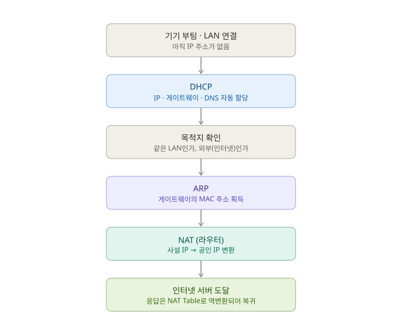

# 네트워크 기초 통신 흐름 (IP · DHCP · ARP · NAT)

이 네 가지는 따로 노는 지식이 아니라, **"기기가 네트워크에 접속해서 인터넷의 서버와 통신하기까지"**의 한 스토리 안에서 각자 역할을 맡는다. 각 프로토콜을 "하나의 질문에 답하는 존재"로 보면 흐름이 깔끔해진다.

| 프로토콜 | 답하는 질문 | 역할 |
|----------|-------------|------|
| IP | 이 네트워크에서 나를 뭐라고 부르지? | 주소 체계 (모든 것의 기반) |
| DHCP | 내 IP 주소를 누가 정해주지? | IP·게이트웨이·DNS 자동 할당 |
| ARP | 이 IP를 가진 상대의 실제(MAC) 주소는? | 같은 LAN 안에서 IP → MAC 변환 |
| NAT | 사설 IP인 내가 어떻게 인터넷에 나가지? | 사설 IP ↔ 공인 IP 변환 |

## 전체 흐름

### ① 접속 직후 — 나는 아직 이름이 없다

방금 켠 기기는 LAN(또는 와이파이)에 연결됐지만 IP 주소가 없어서 통신을 시작할 수 없다.

### ② DHCP — 주소를 받아온다

DHCP 서버(보통 공유기)에게 IP를 요청해서 `IP 주소 + 서브넷마스크 + 게이트웨이 주소 + DNS 서버`를 한 번에 자동으로 받는다. 이 과정을 흔히 DORA(Discover → Offer → Request → Ack) 4단계라고 부른다. 이제 IP라는 "이름"을 갖게 된다.

### ③ 목적지 확인 — 같은 동네인가, 밖인가

패킷을 보낼 때 목적지 IP가 **내 서브넷 안(같은 LAN)인지 밖(인터넷)인지**를 서브넷마스크로 따진다. 이 판단이 다음 단계를 가른다.

- 같은 LAN이면 → 그 상대의 MAC을 ARP로 직접 찾음
- 외부(인터넷)면 → **게이트웨이(공유기)**의 MAC을 ARP로 찾아서 일단 공유기로 보냄

### ④ ARP — IP를 실제 주소(MAC)로 바꾼다

이더넷에서 프레임을 전달하려면 IP가 아니라 **MAC 주소**가 필요하다. "이 IP 가진 분, MAC이 뭐예요?"라고 브로드캐스트로 물어보는 것이 ARP다. 인터넷으로 나갈 땐 게이트웨이의 MAC을 알아낸다.

### ⑤ NAT — 사설 IP로 바깥세상에 나간다

공유기에 도착한 패킷은 아직 출발지가 사설 IP(`192.168.x.x`)다. 인터넷에서는 사설 IP를 쓸 수 없으므로, 공유기가 이걸 **공인 IP로 바꾸고 NAT Table에 매핑을 기록**한 뒤 내보낸다. (Symmetric / Cone 방식이 바로 이 NAT의 세부 동작이다.)

### ⑥ 도착과 복귀

서버는 공인 IP로 응답을 보내고, 공유기는 NAT Table을 보고 **어느 내부 기기였는지 역추적**해서 원래 기기로 되돌려준다.

## 한 문장 요약

> **IP(주소 체계)** 라는 판 위에서, **DHCP**로 내 주소를 얻고 → **ARP**로 다음 홉의 실제 주소를 찾고 → **NAT**로 사설망과 인터넷 사이를 넘나든다.

## 계층(OSI) 관점

| 프로토콜 | 동작 계층 |
|----------|-----------|
| IP, NAT | L3 (네트워크) |
| ARP, MAC | L2 (데이터링크) |
| DHCP | 응용 계층에서 동작하며 위 주소들을 부트스트랩 |
