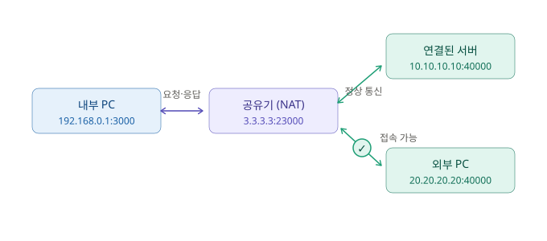

# Full Cone NAT 방식 정리

## 1. 핵심 개념

내부 주소와 외부 주소를 **1:1로 고정 매핑**한다.

```
Internal IP:Port  ↔  External IP(global):Port   (1:1 매핑)
```

즉 어느 서버와 통신하든 하나의 내부 소켓은 **항상 같은 외부 포트**를 사용한다. (Symmetric처럼 세션마다 포트가 바뀌지 않는다.)

## 2. 시나리오

| 구성 요소 | 주소 | 설명 |
|-----------|------|------|
| 내부 PC | `192.168.0.1:3000` | LAN 안에서 서버로 통신을 시작 |
| 공유기 (NAT) | `3.3.3.3:23000` | 내부 주소를 공인 주소로 1:1 변환 |
| 연결된 서버 | `10.10.10.10:40000` | 정상 통신 중인 상대 |
| 외부 PC | `20.20.20.20:40000` | 나중에 접속을 시도하는 제3자 |

## 3. 동작 흐름



- **내부 PC → 공유기**: `192.168.0.1:3000`을 `3.3.3.3:23000`으로 변환해 내보낸다.
- **공유기 ↔ 서버**: 연결된 서버와 정상적으로 양방향 통신한다.
- **외부 PC → 공유기**: 외부 PC가 `DST 3.3.3.3:23000`, `SRC 20.20.20.20:40000`으로 접속을 시도하면 → **접속 가능**.
    - Symmetric에서는 `Drop` 되던 화살표가 Full Cone에서는 그대로 통과한다.

## 4. NAT Table

| Local IP | Local Port | External Port | Remote IP | Remote Port | Protocol |
|----------|-----------|---------------|-----------|-------------|----------|
| 192.168.0.1 | 3000 | 23000 | **Any** | **Any** | **Any** |

Symmetric과의 결정적 차이는 **Remote IP / Remote Port / Protocol이 전부 `Any`**라는 점이다. 이 세 값을 검사하지 않으므로, 매핑된 `3.3.3.3:23000`만 알면 **누가 보내든** 내부 PC로 전달된다.

## 5. Symmetric과의 비교


| 구분 | 내부↔외부 포트 | Remote 검사 | NAT Table Remote | 보안성 |
|------|---------------|------------|------------------|--------|
| **Full Cone** | 1 : 1 (고정) | 안 함 | `Any` | 낮음 |
| **Symmetric** | 1 : N (세션마다) | 함 (엄격) | 구체적 IP:Port | 높음 |

- `1:1` / `1:N` → 내부 소켓이 외부 포트를 몇 개 쓰느냐의 문제
- `Any` / 구체값 → 되돌아오는 패킷의 상대를 검사하느냐의 문제

## 6. 장단점

- **장점**: 외부 PC가 `Global IP / External Port`만 알면 **직접 접속(P2P)이 가능** → 게임 연결, 화상통화 등에 유용
- **단점**: Remote를 검사하지 않으므로 Symmetric NAT보다 **보안성이 떨어짐**

## 7. 추가 개념 (P2P 보조 기술)

- **홀 펀칭(Hole Punching)**: 양쪽이 동시에 서로에게 패킷을 보내 NAT에 매핑(구멍)을 뚫어, 방화벽을 우회해 직접 연결을 성립시키는 기법
- **랑데뷰 서버(Rendezvous Server)**: 두 P2P 단말이 서로의 연결 정보(공인 IP·Port)를 교환하도록 중개해 주는 서버. 연결 정보만 주고받게 도와줄 뿐 실제 데이터는 단말끼리 직접 주고받음
- **릴레이 서버(Relay Server)**: 직접 연결이 안 될 때(예: 양쪽 모두 Symmetric NAT), 중개자 역할로 **서버를 거쳐** 상대 endPoint로 데이터를 전달. WebRTC의 TURN 서버가 대표적인 예
