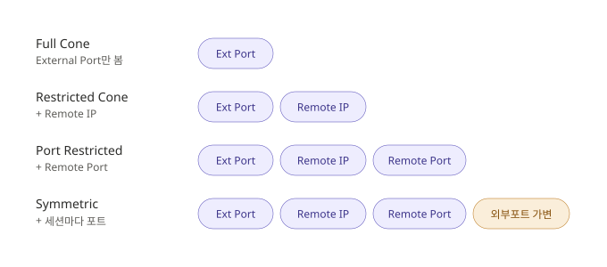

# Restricted Cone NAT 방식 정리

Restricted Cone은 **(Address) Restricted Cone**과 **Port Restricted Cone** 두 가지로 나뉜다. Full Cone처럼 내부↔외부는 1:1 고정 매핑이지만, **되돌아오는 패킷의 상대를 어디까지 검사하느냐**가 다르다. Full Cone은 아무나 허용했지만, Restricted 계열은 "내가 먼저 통신을 시작했던 상대"인지 확인한다.

## 1. (Address) Restricted Cone

External Port + Remote **IP** 를 검사한다. NAT Table의 Remote Port가 `Any`이므로, **IP만 맞으면 Port는 달라도 허용**된다.

### NAT Table

| Local IP | Local Port | External Port | Remote IP | Remote Port | Protocol |
|----------|-----------|---------------|-----------|-------------|----------|
| 192.168.0.1 | 3000 | 23000 | 10.10.10.10 | **Any** | Any |

### 접속 판정 예시

| 접속 시도 | 판정 | 이유 |
|-----------|:----:|------|
| `10.10.10.10:40000` (원래 연결한 서버) | 연결 O | IP 일치 |
| `10.10.10.10:5000` (같은 IP, 다른 Port) | **연결 O** | IP만 보므로 허용 |
| `20.20.20.20:40000` (다른 IP) | 연결 X | IP 불일치 |

> 요약: inbound 시 outbound로 보낸 **external Port + remote IP**를 보고 허용.

## 2. Port Restricted Cone

External Port + Remote IP + Remote **Port** 를 검사한다. **IP와 Port가 모두 일치**해야 허용된다.

### NAT Table

| Local IP | Local Port | External Port | Remote IP | Remote Port | Protocol |
|----------|-----------|---------------|-----------|-------------|----------|
| 192.168.0.1 | 3000 | 23000 | 10.10.10.10 | **40000** | Any |

### 접속 판정 예시

| 접속 시도 | 판정 | 이유 |
|-----------|:----:|------|
| `10.10.10.10:40000` (원래 연결한 서버) | 연결 O | IP·Port 모두 일치 |
| `10.10.10.10:5000` (같은 IP, 다른 Port) | **연결 X** | Port 불일치 |
| `20.20.20.20:40000` (다른 IP) | 연결 X | IP 불일치 |

> 요약: inbound 시 outbound로 보낸 **external Port + remote IP + remote Port**를 보고 허용.

## 3. 두 방식의 차이

두 방식의 차이는 딱 하나, **"Remote Port까지 검사하느냐"**이다.

- **(Address) Restricted Cone**: IP만 검사 → 같은 IP의 다른 Port에서 온 패킷도 통과
- **Port Restricted Cone**: IP + Port 검사 → 같은 IP라도 Port가 다르면 차단

## 4. 전체 유형 비교 — 검사 항목 사다리

Full Cone → Restricted → Port Restricted → Symmetric으로 갈수록 **검사 항목이 하나씩 늘어나** 더 엄격해진다.

| 유형 | 검사 항목 | 같은 IP·다른 Port 접속 | 보안성 |
|------|-----------|:---:|:---:|
| Full Cone | External Port | 허용 | 낮음 |
| **Restricted Cone** | + Remote IP | **허용** | 중간 |
| **Port Restricted Cone** | + Remote Port | **차단** | 높음 |
| Symmetric | + 세션마다 포트 변경 | 차단 | 가장 높음 |

- 아래로 갈수록 검사하는 항목(보라색)이 늘어나 개방적 → 엄격으로 이동한다.
- Symmetric은 여기에 더해 외부 포트 자체가 세션마다 바뀌어(주황색) 가장 엄격하다.
