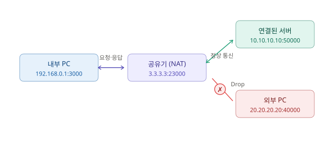
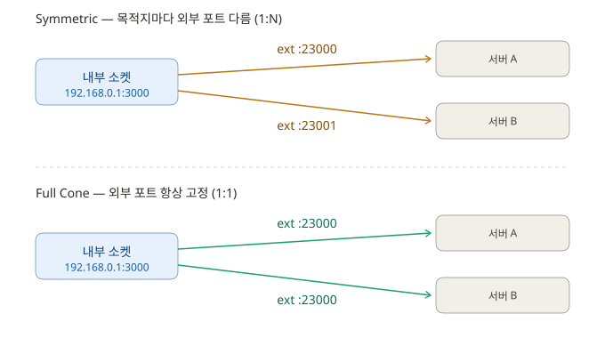

# Symmetric NAT 방식 정리

## 1. 시나리오

| 구성 요소 | 주소 | 설명 |
|-----------|------|------|
| 내부 PC | `192.168.0.1:3000` | LAN 안에서 서버로 통신을 시작 |
| 공유기 (NAT) | `3.3.3.3:23000` | Outbound 시 내부 주소를 공인 주소로 변환 |
| 연결된 서버 | `10.10.10.10:50000` | 정상적으로 통신 중인 상대 |
| 외부 PC | `20.20.20.20:40000` | 나중에 끼어들어 접속을 시도하는 제3자 |

## 2. 동작 흐름

- **내부 PC → 공유기**: 요청이 나갈 때 공유기가 `192.168.0.1:3000`을 `3.3.3.3:23000`으로 변환해 내보낸다.
- **공유기 ↔ 서버**: 연결된 서버(`10.10.10.10:50000`)와는 매핑이 존재하므로 양방향 통신이 정상적으로 이루어진다.
- **외부 PC → 공유기**: 외부 PC가 `DST 3.3.3.3:23000`, `SRC 20.20.20.20:40000`으로 접속을 시도한다.
    - 공유기는 **remote IP + remote Port + external Port** 조합으로 NAT Table을 검색한다.
    - 이 조합에 맞는 매핑 데이터가 없으므로 패킷을 **Drop** 한다.

## 3. NAT Table

| Local IP | Local Port | External Port | Remote IP | Remote Port | Protocol |
|----------|-----------|---------------|-----------|-------------|----------|
| 192.168.0.1 | 3000 | 23000 | 10.10.10.10 | 50000 | TCP |

## 4. 매핑 관계 — Symmetric은 1:1이 아니라 1:N

`1:1` / `1:N`이라는 말은 **[내부 IP:Port] ↔ [외부 IP:Port]** 관계를 가리킨다. Remote(상대방)와의 관계가 아니다.

> 판단 기준: **하나의 내부 소켓(`192.168.0.1:3000`)이 외부 포트를 몇 개 만들어내는가?**

- **Symmetric (1:N)**: 목적지가 바뀔 때마다 외부 포트를 새로 발급한다. 그래서 하나의 내부 소켓에서 외부 포트가 여러 개 생긴다.
- **Full Cone (1:1)**: 어느 서버와 통신하든 외부 포트를 하나로 고정해 재사용한다.

위 그림처럼 Symmetric에서는 서버 A로 갈 땐 `23000`, 서버 B로 갈 땐 `23001`로 **외부 포트가 세션마다 달라진다.** 목적지마다 별도의 매핑 행이 생기기 때문에, NAT Table의 Remote 칸도 `10.10.10.10:50000`처럼 **구체적인 값**으로 채워진다.

### `Any`와의 차이

Full Cone 테이블의 Remote가 `Any`인 것은 "여러 개로 매핑됐다"는 뜻이 **아니라**, **되돌아오는 패킷의 상대를 검사하지 않는다**는 뜻이다. 반대로 Symmetric은 Remote를 엄격히 검사한다.

| 구분 | 내부↔외부 포트 | Remote 검사 | NAT Table Remote |
|------|---------------|------------|------------------|
| **Full Cone** | 1 : 1 (고정) | 안 함 | `Any` |
| **Symmetric** | 1 : N (세션마다) | 함 (엄격) | 구체적 IP:Port |

핵심 한 줄 정리:

- **`1:1` / `1:N`** → 내부 소켓이 외부 포트를 몇 개 쓰느냐의 문제
- **`Any` / 구체값** → 되돌아오는 패킷의 상대를 검사하느냐의 문제

두 개는 서로 다른 축이다.

## 5. 보안성 (핵심 포인트)

Outbound 시 공유기는 NAT Mapping Table에 **Local IP, Local Port, External Port, Remote IP, Remote Port**를 모두 함께 맵핑한다. 이 "5-튜플" 매핑이 Symmetric NAT의 보안성이 높은 이유다.

- **연결된 서버(10.10.10.10:50000)**가 응답을 보내면 → 5개 값이 테이블과 정확히 일치 → **통과**
- **외부 PC(20.20.20.20:40000)**가 `3.3.3.3:23000`으로 접속을 시도하면 → remote IP·remote Port가 테이블 값과 다름 → **검색 대상이 없어 Drop**

즉, 내가 먼저 통신을 시작했던 바로 그 상대(IP·Port까지 동일)만 되돌아올 수 있고, 그 외의 접속 시도는 전부 걸러지므로 공유기가 자연스럽게 **Packet Filter(방화벽)** 역할을 하게 된다.

---

> **표기 참고**: 원본 노트 상단에는 서버 포트가 `40000`으로, NAT Table에는 `50000`으로 적혀 있어 값이 서로 다르다. 개념상 동일한 "연결된 서버"를 가리켜야 하므로 이 문서에서는 테이블 값(`50000`)으로 통일했다.
