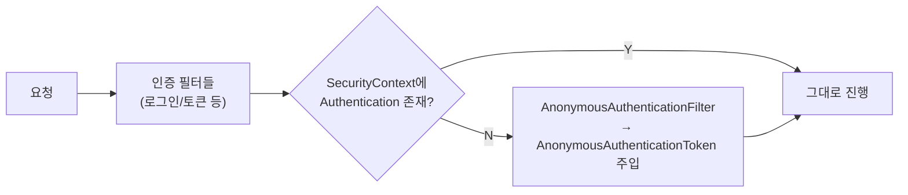
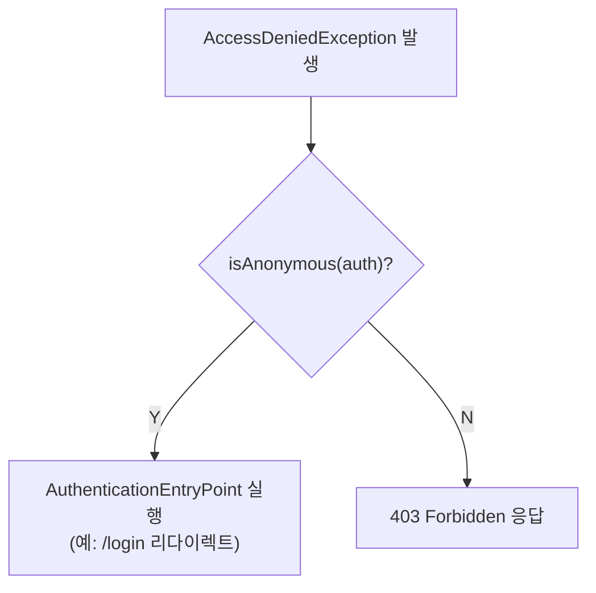

# Spring Security - Anonymous Authentication (익명 인증)

로그인하지 않은 사용자도 `null`이 아닌 **익명 인증 객체(`AnonymousAuthenticationToken`)** 로 표현하는 기능. 접근 제어를 더 편하게 구성하기 위한 장치다.

---

## 1. 핵심 개념

- **"익명으로 인증된 사용자"와 "인증되지 않은 사용자"는 개념적으로 차이가 없다.**
  익명 인증은 접근 제어 속성을 편리하게 구성하기 위한 방식일 뿐이다.
- 그 덕분에 **`SecurityContextHolder`는 항상 `Authentication` 객체를 포함하고 절대 `null`을 담지 않는다.**
  → 코드에서 매번 null 체크를 하지 않아도 되어 더 견고하게 작성 가능.
- 익명 사용자의 인증 정보는 **HttpSession에 저장되지 않는다.** (요청마다 필터가 새로 생성)
    - 반면 실제 로그인 사용자의 SecurityContext는 세션에 저장된다.
- 서블릿 API(`getUserPrincipal` / `getCallerPrincipal` 등)는 익명일 때 **`null`을 반환**한다.
  (SecurityContextHolder에는 익명 토큰이 들어 있어도 서블릿 API 레벨에서는 null)

> ⚠️ 노트 오타 정정: `Anonymouse` → **`Anonymous`**, `ROLE_ANONYMOUSE` → **`ROLE_ANONYMOUS`**, `anonymouseUser` → **`anonymousUser`**

---

## 2. 협력하는 3개 클래스

| 클래스 | 역할 |
|--------|------|
| `AnonymousAuthenticationToken` | `Authentication` 구현체. 익명 principal에 적용될 `GrantedAuthority`를 담는다. |
| `AnonymousAuthenticationProvider` | `ProviderManager`에 연결되어 `AnonymousAuthenticationToken`을 인증 대상으로 허용한다. |
| `AnonymousAuthenticationFilter` | 일반 인증 필터들 **뒤에** 위치. 기존 `Authentication`이 없으면 `AnonymousAuthenticationToken`을 `SecurityContextHolder`에 자동으로 넣는다. |

### AnonymousAuthenticationToken 기본값
- **principal**: `anonymousUser`
- **authorities**: `ROLE_ANONYMOUS`



---

## 3. 설정 (DSL)

```java
http
    .anonymous(anonymous -> anonymous
        .principal("guest")
        .authorities("ROLE_GUEST")
    );
```

| 옵션 | 설명 |
|------|------|
| `.principal(...)` | 익명 사용자 principal 이름 (기본 `anonymousUser`) |
| `.authorities(...)` | 익명 사용자 권한 (기본 `ROLE_ANONYMOUS`) |
| `.key(...)` | 토큰 무결성 검증용 key (미지정 시 자동 생성) |
| `.disable()` | 익명 인증 기능 비활성화 |

> ⚠️ 메서드명은 `.anonymouse(...)` ❌ → **`.anonymous(...)`** ⭕

---

## 4. 컨트롤러에서 익명 Authentication 얻기 ⭐

### 문제
컨트롤러 파라미터로 `Authentication`을 받으면, **익명 요청에서는 `AnonymousAuthenticationToken`이 아니라 `null`이 들어온다.**

```java
@GetMapping("/")
public String method(Authentication authentication) {
    // 익명 요청이면 authentication == null
    if (authentication instanceof AnonymousAuthenticationToken) {
        return "anonymous";
    }
    return "not anonymous"; // 익명이어도 항상 여기로 옴 ❗
}
```

**이유**: Spring MVC는 `Authentication`/`Principal` 타입 파라미터를 자체 argument resolver로 처리하는데, 내부적으로 `HttpServletRequest#getUserPrincipal()`을 사용한다. 이 값은 **익명 요청일 때 `null`** 이다.

### 해결: `@CurrentSecurityContext` 사용
`@CurrentSecurityContext`는 **`CurrentSecurityContextArgumentResolver`** 가 처리하며, 서블릿 API가 아니라 **`SecurityContextHolder`에서 직접** 컨텍스트를 꺼낸다. 따라서 익명이든 실제 로그인이든 항상 올바른 `Authentication`을 얻을 수 있다.

```java
// SecurityContext 자체를 주입
@GetMapping("/")
public String method(@CurrentSecurityContext SecurityContext context) {
    return context.getAuthentication().getName(); // 익명이면 "anonymousUser"
}
```

```java
// SpEL로 authentication만 바로 주입
@GetMapping("/")
public String method(
        @CurrentSecurityContext(expression = "authentication") Authentication authentication) {
    return authentication.getName();
}
```

| 방식 | 익명 요청 시 결과 |
|------|-------------------|
| `Authentication` 파라미터 | **`null`** (`getUserPrincipal()` 기반) |
| `SecurityContextHolder.getContext().getAuthentication()` | 항상 non-null (`AnonymousAuthenticationToken`) |
| `@CurrentSecurityContext` | 항상 non-null (`AnonymousAuthenticationToken`) |

---

## 5. 보충: AuthenticationTrustResolver

익명 인증을 "특별한 인증 상태"로 구분해서 판단하게 해주는 인터페이스.

- 구현체: `AuthenticationTrustResolverImpl`
- 주요 메서드: `isAnonymous(Authentication)`, `isRememberMe(Authentication)`, `isFullyAuthenticated(Authentication)`

### 활용 지점: ExceptionTranslationFilter
`AccessDeniedException`이 발생했을 때 인증이 **익명 타입이면**, 곧바로 403(Forbidden)을 던지지 않고 **`AuthenticationEntryPoint`를 실행**해 사용자가 제대로 로그인하도록 유도한다.
→ 즉 "익명 사용자가 보호 자원 접근 → 403이 아니라 로그인 페이지로" 흐름이 여기서 나온다.



---

## 요약

- 익명 인증 = 미인증 사용자를 `null` 대신 `AnonymousAuthenticationToken`으로 표현 → `SecurityContextHolder`가 항상 non-null.
- 익명 인증 정보는 **세션에 저장하지 않음** (요청마다 `AnonymousAuthenticationFilter`가 생성).
- 3개 클래스 협력: `AnonymousAuthenticationToken` + `AnonymousAuthenticationProvider` + `AnonymousAuthenticationFilter`.
- 기본값: principal `anonymousUser`, authority `ROLE_ANONYMOUS`.
- **컨트롤러 `Authentication` 파라미터는 익명이면 `null`** → `@CurrentSecurityContext`로 받아야 익명 토큰을 얻는다.
- `AuthenticationTrustResolver.isAnonymous()`가 `ExceptionTranslationFilter`에서 익명 사용자에게 403 대신 로그인 유도를 하게 해준다.