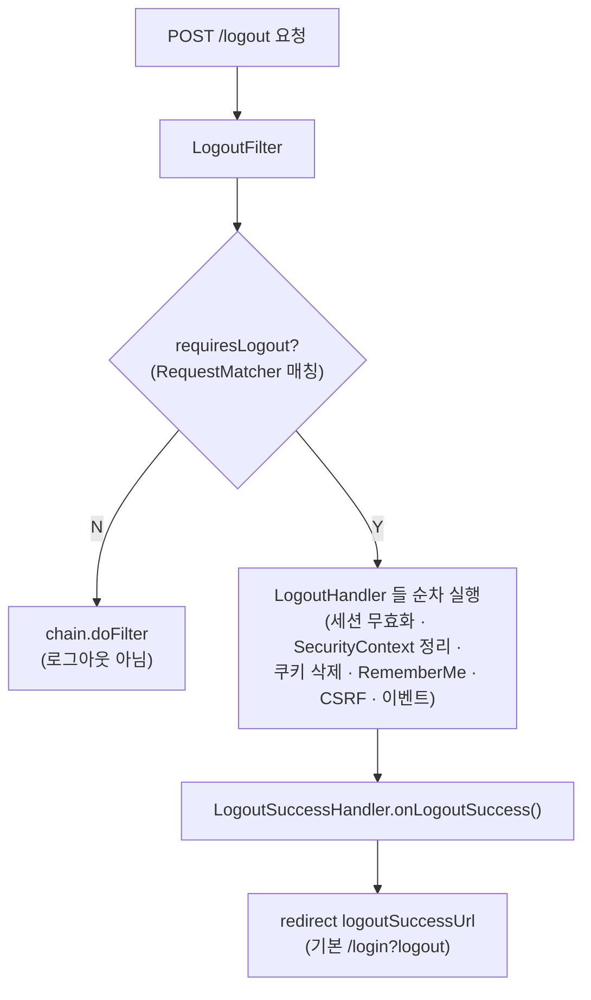

# Spring Security - Logout

로그인한 사용자의 인증 상태를 해제하고(세션 무효화, SecurityContext 삭제 등) 지정된 위치로 이동시키는 기능. `LogoutFilter`가 처리한다.

---

## 1. 기본 동작

- **`DefaultLogoutPageGeneratingFilter`** 가 로그아웃 확인 페이지를 제공 → **`GET /logout`** 으로 접근 가능.
- 실제 로그아웃 실행은 **`POST /logout`**.
- CSRF가 켜져 있으면(기본값) 로그아웃은 POST여야 하며, GET 확인 페이지는 CSRF 토큰을 넘겨주는 수단으로도 쓰인다.
    - **CSRF를 비활성화하면** 확인 페이지 없이 바로 로그아웃되고, `logoutRequestMatcher`로 메서드를 지정하면 **GET/PUT/DELETE** 등도 로그아웃 트리거로 쓸 수 있다.
- **`LogoutFilter`를 거치지 않고** 스프링 MVC에서 커스텀하게 구현할 수도 있다.
    - 로그인 페이지를 커스텀으로 만들면 **로그아웃도 커스텀으로 구현**해야 하는 경우가 많다(기본 페이지 생성 필터가 동작하지 않으므로).

> 💡 `LogoutFilter`는 필터 체인에서 `AuthorizationFilter`보다 **앞**에 위치한다.
> 따라서 기본 `/logout` 엔드포인트는 별도 `permitAll` 없이도 접근 가능하고,
> **직접 만든 커스텀 로그아웃 엔드포인트**만 `permitAll`이 필요한 경우가 일반적이다.

---

## 2. POST /logout 시 기본 수행 작업 (기본 LogoutHandler 체인)

`POST /logout` 요청 시 여러 `LogoutHandler`가 순차적으로 실행된다.

| 수행 작업 | 담당 핸들러 |
|-----------|-------------|
| HTTP 세션 무효화 | `SecurityContextLogoutHandler` |
| `SecurityContextHolderStrategy` 정리 | `SecurityContextLogoutHandler` |
| `SecurityContextRepository` 정리 | `SecurityContextLogoutHandler` |
| RememberMe 인증 정리 | `TokenBasedRememberMeServices` / `PersistentTokenBasedRememberMeServices` |
| 저장된 CSRF 토큰 제거 | `CsrfLogoutHandler` |
| `LogoutSuccessEvent` 발행 | `LogoutSuccessEventPublishingLogoutHandler` |

완료 후 기본 `LogoutSuccessHandler`가 **`/login?logout`** 으로 리다이렉트한다.

---

## 3. 로그아웃 처리 흐름



---

## 4. logout() DSL 설정 옵션

```java
http
    .logout(logout -> logout
        .logoutUrl("/logout")
        .logoutSuccessUrl("/login")
        .deleteCookies("JSESSIONID", "remember-me")
        .invalidateHttpSession(true)
        .clearAuthentication(true)
        .addLogoutHandler((request, response, authentication) -> {
            // 커스텀 로그아웃 로직
        })
        .permitAll()
    );
```

| 옵션 | 설명 | 기본값 / 비고 |
|------|------|---------------|
| `.logoutUrl(...)` | 로그아웃이 발생하는 URL 지정 | 기본 `/logout` |
| `.logoutRequestMatcher(...)` | 로그아웃 트리거를 `RequestMatcher`로 지정 | **`logoutUrl`보다 우선순위 높음** |
| `.logoutSuccessUrl(...)` | 로그아웃 후 리다이렉트 URL | 기본 `/login?logout` |
| `.logoutSuccessHandler(...)` | 로그아웃 성공 후 처리 핸들러 | **`logoutSuccessUrl`보다 우선** |
| `.deleteCookies(...)` | 로그아웃 성공 시 제거할 쿠키 이름 지정 | 예: `"JSESSIONID"` |
| `.invalidateHttpSession(boolean)` | HttpSession 무효화 여부 | **기본 `true`** |
| `.clearAuthentication(boolean)` | `SecurityContextLogoutHandler`가 인증(Authentication)을 삭제할지 여부 | **기본 `true`** |
| `.addLogoutHandler(...)` | 기존 `LogoutHandler` 체인 **뒤에** 새 핸들러 추가 | |
| `.permitAll()` | `logoutUrl` / `RequestMatcher` URL에 대한 모든 사용자 접근 허용 | 성공 URL도 포함 |

### logoutRequestMatcher 예시

```java
// 방식 1: AntPathRequestMatcher — 특정 메서드로 로그아웃 트리거
.logoutRequestMatcher(new AntPathRequestMatcher("/logoutProc", "POST"))
```

> ⚠️ **버전 참고**: `AntPathRequestMatcher`는 Spring Security 6.5+/7.0에서 deprecated 되고
> **`PathPatternRequestMatcher`** 로 대체되는 추세다. 최신 버전에서는 아래처럼 쓴다.
>
> ```java
> import static org.springframework.security.web.util.matcher.PathPatternRequestMatcher.withDefaults;
>
> .logoutRequestMatcher(withDefaults().matcher(HttpMethod.POST, "/logoutProc"))
> ```

---

## 5. 핵심 컴포넌트

### LogoutFilter
- 로그아웃 요청을 가로채는 필터. 생성자로 `LogoutSuccessHandler`와 하나 이상의 `LogoutHandler`를 받는다.
- `requiresLogout(request, response)`로 로그아웃 대상 요청인지 판단 → 맞으면 핸들러 실행.

### RequestMatcher
- 어떤 요청을 "로그아웃 요청"으로 볼지 결정. `logoutUrl` 대신 `logoutRequestMatcher`로 URL+메서드까지 세밀하게 지정 가능.

### LogoutHandler (인터페이스)
- 실제 로그아웃 부수 작업(세션 무효화, 컨텍스트 정리, 쿠키 삭제 등)을 수행.
```java
@FunctionalInterface
public interface LogoutHandler {
    void logout(HttpServletRequest request,
                HttpServletResponse response,
                Authentication authentication);
}
```

**주요 구현체**

| 구현체 | 역할 |
|--------|------|
| `SecurityContextLogoutHandler` | 세션 무효화 + SecurityContext/Authentication 정리 (기본 포함) |
| `CookieClearingLogoutHandler` | `.deleteCookies(...)` 지정 쿠키 만료 처리 |
| `CsrfLogoutHandler` | 저장된 CSRF 토큰 제거 |
| `LogoutSuccessEventPublishingLogoutHandler` | `LogoutSuccessEvent` 발행 |
| `HeaderWriterLogoutHandler` | 응답 헤더 작성(예: `Clear-Site-Data`) |
| `CompositeLogoutHandler` | 여러 `LogoutHandler`를 순서대로 묶어 실행 |
| `TokenBasedRememberMeServices` / `PersistentTokenBasedRememberMeServices` | RememberMe 토큰/쿠키 정리 (LogoutHandler 구현) |

### LogoutSuccessHandler (인터페이스)
- 로그아웃 성공 **이후**의 후속 처리(리다이렉트, 상태코드 반환 등)를 담당.
```java
public interface LogoutSuccessHandler {
    void onLogoutSuccess(HttpServletRequest request,
                         HttpServletResponse response,
                         Authentication authentication) throws IOException, ServletException;
}
```

**주요 구현체**

| 구현체 | 역할 |
|--------|------|
| `SimpleUrlLogoutSuccessHandler` | `logoutSuccessUrl`로 리다이렉트 (**기본값**, 기본 `/login?logout`) |
| `HttpStatusReturningLogoutSuccessHandler` | 리다이렉트 대신 HTTP 상태코드 반환 → **REST/API에 적합** |
| `ForwardLogoutSuccessHandler` | 지정 경로로 forward |
| `DelegatingLogoutSuccessHandler` | 조건별로 다른 핸들러에 위임 |

---

## 6. REST/API 환경에서의 로그아웃

리다이렉트가 필요 없는 API라면 성공 시 상태코드만 반환하는 것이 자연스럽다.

```java
http
    .logout(logout -> logout
        .logoutUrl("/api/logout")
        .logoutSuccessHandler(new HttpStatusReturningLogoutSuccessHandler(HttpStatus.OK))
        .deleteCookies("JSESSIONID"));
```

---

## 7. 커스텀 로그아웃 핸들러 추가 예시

```java
http
    .logout(logout -> logout
        .logoutUrl("/logout")
        .addLogoutHandler((request, response, authentication) -> {
            // 예: 사용자 정의 정리 작업 / 로깅
            if (authentication != null) {
                log.info("logout user = {}", authentication.getName());
            }
        })
        .logoutSuccessHandler((request, response, authentication) -> {
            response.sendRedirect("/login?logout");
        }));
```

- `addLogoutHandler`는 **기본 핸들러 체인 뒤에** 추가된다(기본 동작은 유지).
- 기본 핸들러 체인 자체를 완전히 대체하려면 `logoutHandler(...)`/직접 `LogoutFilter` 구성 방식을 사용.

---

## 요약

- **LogoutFilter**가 로그아웃을 처리하며 `AuthorizationFilter`보다 앞에 위치 → 기본 `/logout`은 permitAll 불필요.
- **GET /logout** = 확인 페이지(`DefaultLogoutPageGeneratingFilter`), **POST /logout** = 실제 로그아웃. CSRF 비활성화 또는 `logoutRequestMatcher` 사용 시 다른 메서드도 가능.
- POST /logout 시 기본 핸들러 체인: 세션 무효화 · SecurityContext/Repository 정리 · RememberMe 정리 · CSRF 토큰 제거 · 이벤트 발행 → `/login?logout` 리다이렉트.
- **LogoutHandler**(부수 작업, `logout()`) vs **LogoutSuccessHandler**(후속 처리, `onLogoutSuccess()`) 구분.
- DSL 우선순위: `logoutRequestMatcher` > `logoutUrl`, `logoutSuccessHandler` > `logoutSuccessUrl`.
- API라면 `HttpStatusReturningLogoutSuccessHandler`로 상태코드 반환.