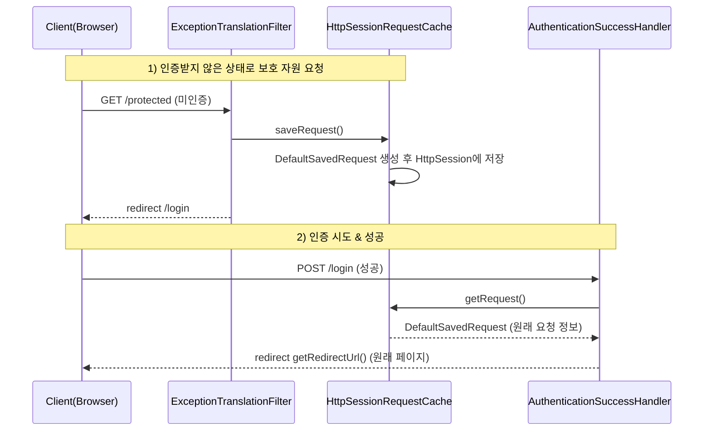
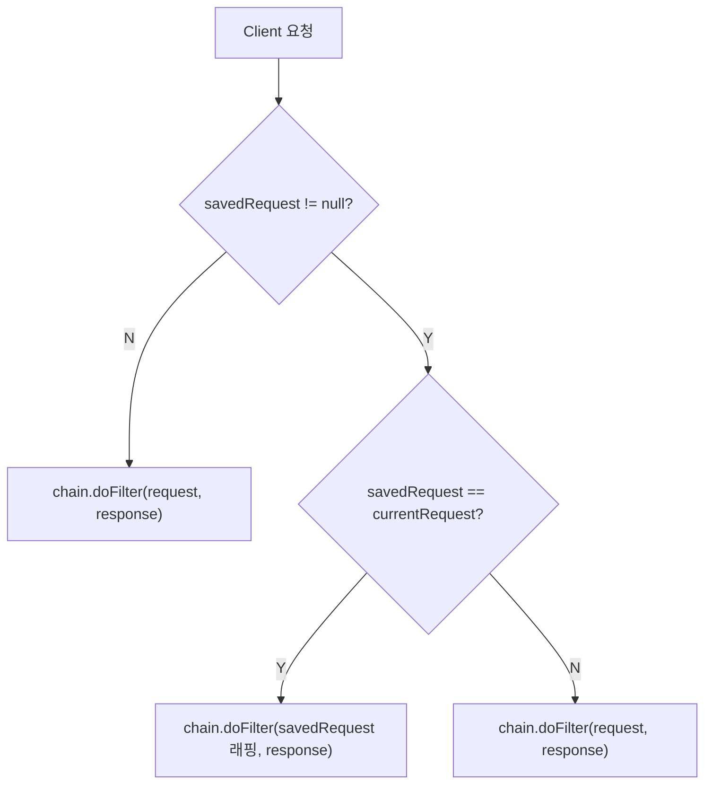

# Spring Security - RequestCache & SavedRequest

인증 절차 때문에 로그인 페이지로 리다이렉트된 사용자를, 인증 성공 후 **원래 가려던 페이지로 되돌려 보내는** 메커니즘.

---

## 1. 핵심 개념

### RequestCache
- 인증 문제로 리다이렉트되기 전, 사용자가 원래 했던 요청 정보를 담은 **`SavedRequest` 객체를 저장/조회**하는 인터페이스.
- 저장소는 구현체에 따라 **세션 또는 쿠키**.

| 구현체 | 저장 위치 | 비고 |
|--------|-----------|------|
| `HttpSessionRequestCache` | HttpSession | **기본값** |
| `CookieRequestCache` | 쿠키 | 세션을 쓰기 어려운 환경(무상태 등) |
| `NullRequestCache` | 저장 안 함 | 요청 복원 기능을 끌 때 |

### SavedRequest (구현체: `DefaultSavedRequest`)
- 인증 이전 요청의 정보(URL, 메서드, 파라미터, 헤더, 쿠키, 로케일 등)를 캡슐화.
- 로그인 등 인증 절차 후, 사용자를 **인증 이전의 원래 페이지로 안내**하는 데 사용.
- `ExceptionTranslationFilter`가 인증 예외 발생 시점에 인스턴스를 생성해 저장한다.
- 세션 저장 시 키 이름: `SPRING_SECURITY_SAVED_REQUEST`

---

## 2. 전체 동작 흐름



1. **인증받지 않은 요청**
    - `ExceptionTranslationFilter`가 인증 예외를 감지
    - `HttpSessionRequestCache.saveRequest()` → `DefaultSavedRequest` 생성 후 `HttpSession`에 저장 (인증 이전 요청 정보 보관)
    - `/login`으로 redirect

2. **인증 시도 (성공)**
    - `AuthenticationSuccessHandler`에서 `HttpSessionRequestCache`로부터 `SavedRequest`를 꺼냄
    - `savedRequest.getRedirectUrl()`로 인증 이전 요청 URL을 얻어 redirect

---

## 3. matchingRequestParameterName

특정 쿼리 파라미터가 요청에 있을 때에만 `SavedRequest`를 꺼내오도록 설정할 수 있다.

```java
HttpSessionRequestCache requestCache = new HttpSessionRequestCache();
requestCache.setMatchingRequestParameterName("customParam=Y"); // 메서드명·값 주의

http
    .requestCache(cache -> cache
        .requestCache(requestCache));
```

> ⚠️ **자주 하는 오타**
> - 메서드명은 `setMatchingRequestParameter` ❌ → `setMatchingRequestParameterName` ⭕
> - 값에 앞 슬래시(`/customParam=Y`) ❌ → `customParam=Y` ⭕

### 동작 원리
- 저장된 요청으로 리다이렉트할 때, `DefaultSavedRequest.getRedirectUrl()`이 이 파라미터를 **쿼리 스트링 뒤에 자동으로 덧붙인다.**
    - 예: 원래 `/board?id=1` → 리다이렉트 URL `/board?id=1&customParam=Y`
    - 원래 쿼리가 없으면 → `/board?customParam=Y`
- 이후 브라우저가 그 URL로 다시 요청하면, `getMatchingRequest()`가 **해당 파라미터가 있을 때에만 세션을 조회**해 `SavedRequest`를 복원한다.

### 기본값과 Spring Security 6의 변화
- 기본값은 `"continue"`.
- **Spring Security 5**: 매 요청마다 세션의 `SavedRequest`를 조회 → 불필요한 세션 접근 발생.
- **Spring Security 6**: 해당 파라미터가 있을 때에만 조회 → **불필요한 세션 접근을 줄이는 성능 개선**이 기본 동작이 됨.

---

## 4. 요청을 저장하고 싶지 않은 경우

요청 복원 기능 자체를 끄려면 `NullRequestCache` 사용.

```java
RequestCache nullRequestCache = new NullRequestCache();

http
    .requestCache(cache -> cache
        .requestCache(nullRequestCache));
```

---

## 5. RequestCacheAwareFilter

이전에 저장했던 웹 요청을 **다시 불러와 재현**하는 역할을 하는 필터.



- `SavedRequest`가 현재 요청과 **일치하면** → 저장된 요청을 래핑하여 필터 체인의 `doFilter`로 전달 (원래 요청 재현)
- `SavedRequest`가 **없거나 일치하지 않으면** → 원래 요청을 그대로 진행

> 일치 여부는 `DefaultSavedRequest.doesRequestMatch()`로 판단하며, URL 관련 값(스킴/호스트/포트/URI/쿼리스트링)을 비교한다. (쿠키·헤더·파라미터는 비교 대상 아님)

---

## 6. 협력 관계 요약

| 컴포넌트 | 역할 |
|----------|------|
| `ExceptionTranslationFilter` | 인증 예외 발생 시 `saveRequest()` 호출 (저장 시점) |
| `RequestCache` | `SavedRequest` 저장/조회 |
| `AuthenticationSuccessHandler` | 인증 성공 후 `getRequest()`로 꺼내 원래 URL로 redirect |
| `RequestCacheAwareFilter` | 리다이렉트 후 저장된 요청을 재현 |

```

> 사실 위 로직(널 처리 + 기본 URL 폴백)은 스프링이 제공하는
> **`SavedRequestAwareAuthenticationSuccessHandler`**가 기본으로 해준다.
> 학습 목적이 아니면 커스텀 핸들러 대신 이걸 쓰는 편이 안전하다.

---

## 요약

- **RequestCache** = 인증 전 요청을 저장(`saveRequest`)/조회(`getRequest`)하는 메커니즘, 구현체는 세션/쿠키/Null.
- **SavedRequest / DefaultSavedRequest** = 저장되는 요청 정보 객체, `getRedirectUrl()`로 원래 URL 획득.
- **matchingRequestParameterName**(기본 `continue`) = 해당 파라미터가 있을 때만 세션 조회 → SS6 성능 개선.
- **RequestCacheAwareFilter** = 리다이렉트 후 저장된 요청을 재현.
