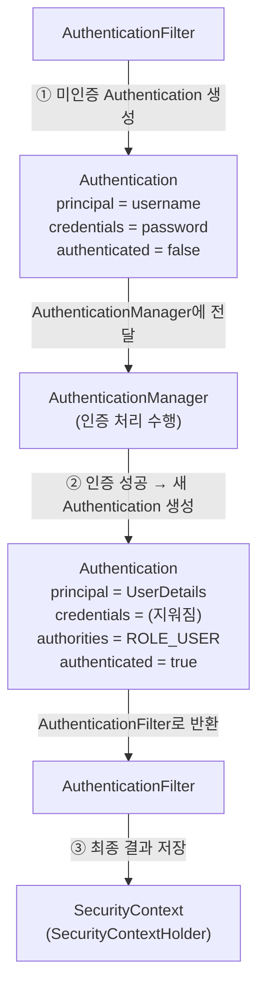

# Spring Security - Authentication (인증)


## 1. 인증(Authentication)이란

- 인증은 **특정 자원에 접근하려는 사람의 신원을 확인**하는 방법을 의미한다.
- 일반적인 방법은 사용자 아이디/비밀번호를 입력받는 것으로, 인증이 수행되면 신원을 알게 되고 그에 맞는 권한을 부여한다.
- **`Authentication`** 은 사용자의 인증 정보를 저장하는 **토큰 개념의 객체**로 활용되며,
  인증 이후 **`SecurityContext`에 저장**되어 애플리케이션 전역에서 참조할 수 있다.

> `Authentication`은 두 가지 의미를 동시에 가진다.
> ① **인증 요청**을 담는 토큰, ② `AuthenticationManager.authenticate()`가 처리한 뒤의 **인증된 주체**.

---

## 2. Authentication 인터페이스

`Authentication`은 **`java.security.Principal`과 `Serializable`을 상속**한다.
→ 그래서 서블릿 API(`getUserPrincipal()`)나 `getName()`과 자연스럽게 연동된다.

```java
public interface Authentication extends Principal, Serializable {
    Collection<? extends GrantedAuthority> getAuthorities();
    Object getCredentials();
    Object getDetails();
    Object getPrincipal();
    boolean isAuthenticated();
    void setAuthenticated(boolean isAuthenticated) throws IllegalArgumentException;
    // + getName()  (Principal로부터 상속)
}
```

| 메서드 | 설명 |
|--------|------|
| `getPrincipal()` | **인증 주체**. 인증 요청 시엔 사용자 이름(username), 인증 후엔 `UserDetails` 타입 객체가 될 수 있다. |
| `getCredentials()` | **자격 증명(주로 패스워드)**. 인증 후엔 보안을 위해 지워진다. |
| `getAuthorities()` | 인증 주체에 부여된 **권한**. `GrantedAuthority` 컬렉션. (`AuthenticationManager`가 설정) |
| `getDetails()` | 인증 요청에 대한 **추가 세부 정보** 저장. 웹에서는 보통 `WebAuthenticationDetails`(remoteAddress, sessionId). |
| `isAuthenticated()` | 인증 상태 반환 |
| `setAuthenticated(boolean)` | 인증 상태 설정 |
| `getName()` | 주체 이름 (Principal 상속) |

> ⚠️ 노트 오타 정정: `getCredentals` → **`getCredentials`**, `cridentails` → **`credentials`**,
> `isAutheitncated` → **`isAuthenticated`**, `Authenticatino` → **`Authentication`**,
> `UserDetials` → **`UserDetails`**, `AuthenticationManger` → **`AuthenticationManager`**

### 주요 구현체
공통 부모는 `AbstractAuthenticationToken`이며, 대표 구현체:
- `UsernamePasswordAuthenticationToken` (폼 로그인)
- `AnonymousAuthenticationToken` (익명)
- `RememberMeAuthenticationToken` (자동 로그인)
- `OAuth2AuthenticationToken`, `PreAuthenticatedAuthenticationToken` 등

---

## 3. 인증 처리 흐름과 Authentication의 상태 변화 ⭐

같은 `Authentication` 객체지만 **인증 전 / 후로 내용과 상태가 달라진다.**



### ① 인증 처리 전 (AuthenticationFilter가 생성)
```
Authentication
 ├ principal      = username
 ├ credentials    = password
 ├ authorities    = (비어 있음)
 └ authenticated  = false
```
→ 이 미인증 객체를 `AuthenticationManager`에 전달한다.

### ② 인증 처리 후 (AuthenticationManager가 생성해 반환)
```
Authentication
 ├ principal      = UserDetails   // 시스템에서 조회한 사용자 정보
 ├ credentials    = (지워짐)       // 인증 후 노출 방지를 위해 제거
 ├ authorities    = ROLE_USER     // GrantedAuthority 컬렉션
 └ authenticated  = true
```

| 항목 | 인증 후 값/처리 |
|------|-----------------|
| `principal` | 시스템에서 가져온 사용자 정보, 주로 **`UserDetails`** 객체 |
| `credentials` | 인증된 후 **정보를 지워** 노출되지 않도록 한다 |
| `authorities` | 사용자에게 부여된 권한, **`GrantedAuthority` 타입 컬렉션** |
| `authenticated` | `true` |

### ③ 저장
최종 인증 결과를 담은 `Authentication` 객체를 **`SecurityContext`에 저장**한다.
(이후 `SecurityContextHolder`를 통해 전역 참조 가능)

---

## 4. 요약

- `Authentication` = 인증 정보를 담는 토큰 객체. **인증 요청**과 **인증 결과** 두 상태를 모두 표현.
- `Principal`, `Serializable` 상속 → `getName()`, 서블릿 API 연동.
- 핵심 메서드: `getPrincipal`, `getCredentials`, `getAuthorities`, `getDetails`, `isAuthenticated`, `setAuthenticated`.
- 상태 변화: **인증 전**(principal=username, credentials=password, authenticated=false) → **인증 후**(principal=UserDetails, credentials 제거, authorities 채워짐, authenticated=true).
- 처리 순서: `AuthenticationFilter`(미인증 생성) → `AuthenticationManager`(인증 수행) → 인증된 객체 반환 → **`SecurityContext`에 저장**.