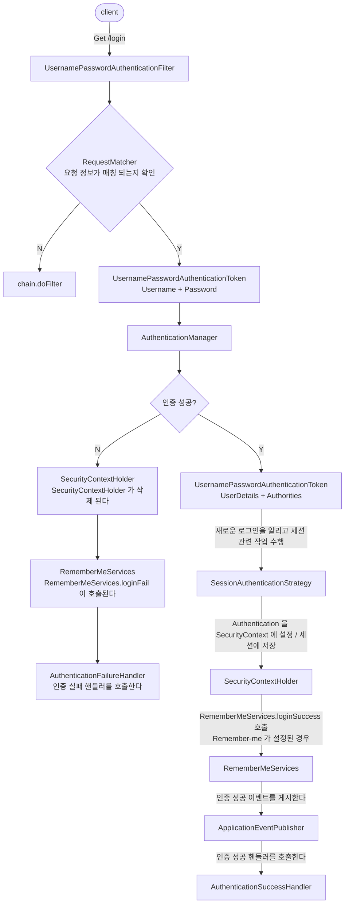

# formLogin() API

- `FormLoginConfigurer` 설정 클래스를 통해 여러 API 들을 설정할 수 있다.
- 내부적으로 `UsernamePasswordAuthenticationFilter` 가 생성되어 폼 방식의 인증 처리를 담당하게 된다.

---

## 기본 사용 형태

```java
HttpSecurity.formLogin(httpSecurityFormLoginConfigurer -> httpSecurityFormLoginConfigurer
    .loginPage("/loginPage")
    .loginProcessingUrl("/loginProc") 
        - action을 loginProcessingUrl과 맞추는 순간, UsernamePasswordAuthenticationFilter가 요청을 가로채서 정해진 흐름(RequestMatcher → 토큰 생성 → AuthenticationManager → 성공/실패 핸들러)을 자동으로 태웁니다.
        - 직접 인증 처리를 하려면 해당 옵션은 필요 없고 loginForm의 action을 처리할 URL을 컨트롤러에서 맵핑해서 처리하면됩니다.
        - 한줄 요약 action == loginProcessingUrl = 필터가 알아서 인증 / 컨트롤러 매핑 = 내가 직접 인증.
    .defaultSuccessUrl("/", alwaysUse)
    .failureUrl("/failed")
    .usernameParameter("username")
    .passwordParameter("password")
    .failureHandler(authenticationFailureHandler)
    .successHandler(authenticationSuccessHandler)
    .permitAll()
);
- defaultSuccessUrl, failureUrl 옵션은 결국 successHandler, failureHandler 이 존재하면
무시되고 successHandler, failureHandler이 실행된다.
```

---

## API 상세 설명

| API | 설명 |
| --- | --- |
| `.loginPage("/loginPage")` | 사용자 정의 로그인 페이지로 전환, 기본 로그인 페이지 무시 |
| `.loginProcessingUrl("/loginProc")` | 사용자 이름과 비밀번호를 검증할 URL 지정 (Form action) |
| `.defaultSuccessUrl("/", [alwaysUse])` | 로그인 성공 이후 이동 페이지. `alwaysUse` 가 `true` 이면 무조건 지정된 위치로 이동 (기본은 `false`) |
| `.failureUrl("/failed")` | 인증에 실패할 경우 사용자에게 보내질 URL 을 지정. 기본값은 `"/login?error"` |
| `.usernameParameter("username")` | 인증을 수행할 때 사용자 이름(아이디)를 찾기 위해 확인하는 HTTP 매개변수 설정. 기본값은 `username` |
| `.passwordParameter("password")` | 인증을 수행할 때 비밀번호를 찾기 위해 확인하는 HTTP 매개변수 설정. 기본값은 `password` |
| `.failureHandler(AuthenticationFailureHandler)` | 인증 실패 시 사용할 `AuthenticationFailureHandler` 를 지정. 기본값은 `SimpleUrlAuthenticationFailureHandler` 를 사용하여 `"/login?error"` 로 리다이렉션 함 |
| `.successHandler(AuthenticationSuccessHandler)` | 인증 성공 시 사용할 `AuthenticationSuccessHandler` 를 지정. 기본값은 `SavedRequestAwareAuthenticationSuccessHandler` 이다 |
| `.permitAll()` | `failureUrl()`, `loginPage()`, `loginProcessingUrl()` 에 대한 URL 에 모든 사용자의 접근을 허용 함 |

---

## 내부 동작 흐름 (소스 코드 분석)

기본 설정으로 폼 로그인을 활성화하는 경우:

```java
http.formLogin(Customizer.withDefaults());
```

### 1. `HttpSecurity.formLogin()`

`formLoginCustomizer` 를 통해 `FormLoginConfigurer` 를 생성/적용한다.

```java
public HttpSecurity formLogin(Customizer<FormLoginConfigurer<HttpSecurity>> formLoginCustomizer) throws Exception {
    formLoginCustomizer.customize(getOrApply(new FormLoginConfigurer<>()));
    return HttpSecurity.this;
}
```

### 2. `new FormLoginConfigurer<>()`

생성자에서 `UsernamePasswordAuthenticationFilter` 를 생성하여 부모 생성자로 넘기고, `username` / `password` 파라미터 기본값을 설정한다.

```java
public FormLoginConfigurer() {
    super(new UsernamePasswordAuthenticationFilter(), null);
    usernameParameter("username");
    passwordParameter("password");
}
```

### 3. `super(new UsernamePasswordAuthenticationFilter(), null)`

부모 클래스 `AbstractAuthenticationFilterConfigurer` 생성자에서 넘겨받은 필터를 `this.authFilter` 에 저장한다. (`defaultLoginProcessingUrl` 이 `null` 이므로 여기서는 별도 URL 설정 없음)

```java
protected AbstractAuthenticationFilterConfigurer(F authenticationFilter, String defaultLoginProcessingUrl) {
    this();
    this.authFilter = authenticationFilter;
    if (defaultLoginProcessingUrl != null) {
        loginProcessingUrl(defaultLoginProcessingUrl);
    }
}
```

### 정리

- `FormLoginConfigurer` 가 `AbstractAuthenticationFilterConfigurer` 를 상속하므로, 결과적으로 `this.authFilter = UsernamePasswordAuthenticationFilter` 를 갖게 된다.
- 즉, **`FormLoginConfigurer` 가 `UsernamePasswordAuthenticationFilter` 를 생성**한다.
- `this.loginPage`, `this.loginProcessingUrl`, `this.failureUrl` 에 대해서는 `permitAll()` 처리를 해줘야 로그인 페이지 접근, 인증 처리, 인증 실패 처리가 모두 정상적으로 가능해진다.

---

## 흐름도 (인증 처리 흐름)

`UsernamePasswordAuthenticationFilter` 가 폼 로그인 요청을 처리하는 전체 흐름이다.



### 단계별 설명

1. **client → `Get /login`** : 클라이언트가 로그인 요청을 보낸다.
2. **`UsernamePasswordAuthenticationFilter`** : 폼 로그인 요청을 가로채는 필터.
3. **`RequestMatcher`** : 요청 정보가 매칭되는지 확인한다.
   - 매칭되지 않으면(**N**) → `chain.doFilter` 로 다음 필터에 위임한다.
4. **`UsernamePasswordAuthenticationToken` (Username + Password)** : 아직 인증되지 않은 토큰을 생성한다.
5. **`AuthenticationManager`** : 인증을 위임받아 처리한다.
6. **인증 성공 여부 판단**

#### 인증 실패 시 (N)

1. **`SecurityContextHolder`** : `SecurityContextHolder` 가 삭제된다.
2. **`RememberMeServices`** : `RememberMeServices.loginFail` 이 호출된다.
3. **`AuthenticationFailureHandler`** : 인증 실패 핸들러를 호출한다.

#### 인증 성공 시 (Y)

1. **`UsernamePasswordAuthenticationToken` (UserDetails + Authorities)** : 인증된 정보(권한 포함)를 담은 토큰을 생성한다.
2. **`SessionAuthenticationStrategy`** : 새로운 로그인을 알리고 세션 관련 작업들을 수행한다.
3. **`SecurityContextHolder`** : `Authentication` 을 `SecurityContext` 에 설정하고, 세션에 `SecurityContext` 가 저장된다.
4. **`RememberMeServices`** : `RememberMeServices.loginSuccess` 를 호출한다. (Remember-me 가 설정된 경우)
5. **`ApplicationEventPublisher`** : 인증 성공 이벤트를 게시한다.
6. **`AuthenticationSuccessHandler`** : 인증 성공 핸들러를 호출한다.

---

## 참고

- `.defaultSuccessUrl()` 은 로그인 성공 후 이동할 기본 위치를 지정하지만, 인증 전에 보안이 필요한 페이지를 방문하다가 인증에 성공한 경우에는 원래(이전) 위치로 리다이렉트된다. (`alwaysUse = true` 로 설정하면 항상 지정된 위치로 이동)
- 원본 슬라이드에서는 `failureHandler` 의 인자가 `AuthenticationSuccessHandler`, `successHandler` 의 인자가 `AuthenticationFailureHandler` 로 표기되어 있으나, 이는 오타이며 실제로는 각각 `AuthenticationFailureHandler`, `AuthenticationSuccessHandler` 를 인자로 받는다. (설명 내용 기준으로 정정함)